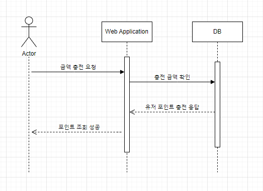
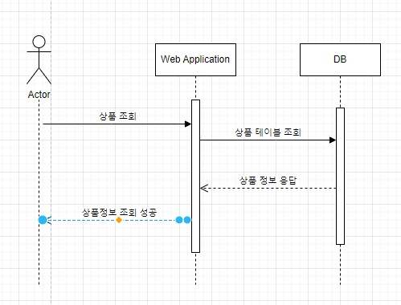

# 요약
**********
이커머스 상품 주문 서비스를 구현한다.

# 개발환경
**********
+ Java 17
+ Spring Boot
+ H2 Database
+ JPA
+ gradle

# 요구사항
********
- 아래 4가지 API 를 구현합니다.
    - 잔액 충전 / 조회 API
    - 상품 조회 API
    - 주문 / 결제 API
    - 인기 판매 상품 조회 API
- 각 기능 및 제약사항에 대해 단위 테스트를 반드시 하나 이상 작성하도록 합니다.
- 다수의 인스턴스로 어플리케이션이 동작하더라도 기능에 문제가 없도록 작성하도록 합니다.
- 동시성 이슈를 고려하여 구현합니다.
- 재고 관리에 문제 없도록 구현합니다.

# 시퀀스 다이어그램
*****
### 포인트 충전 
 

### 상품 조회 
 

### 주문 결제 

