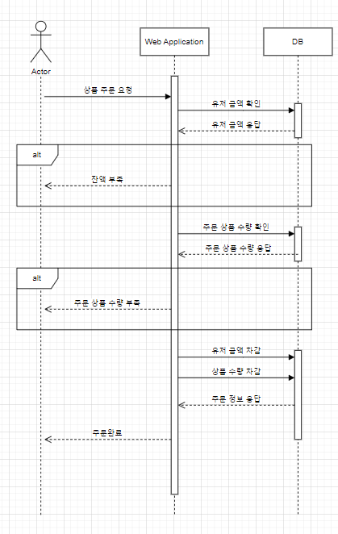
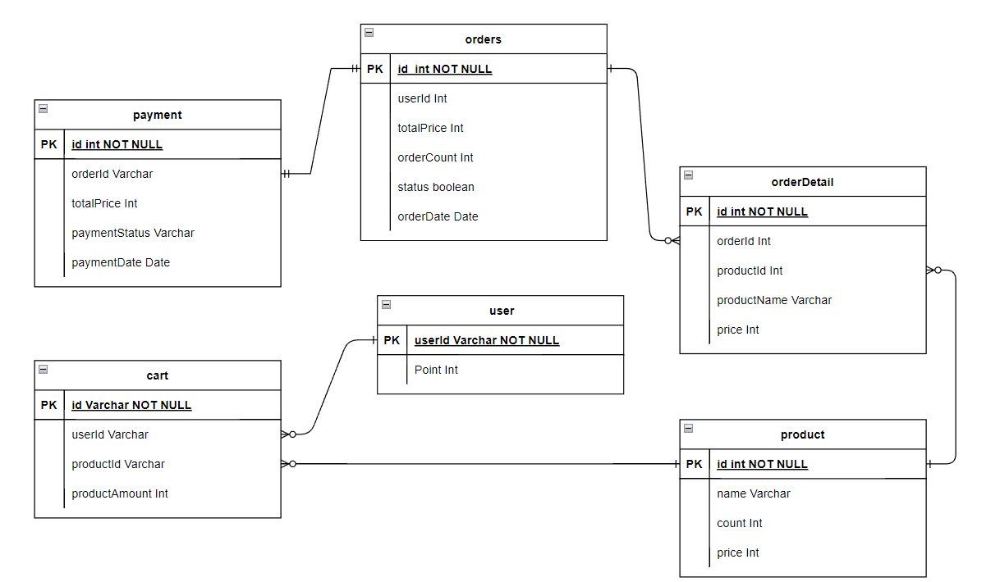

# 개요
**********
이커머스 상품 주문 서비스를 구현한다.

# 개발환경
**********
+ Java 17
+ Spring Boot
+ H2 Database
+ JPA
+ gradle

# 요구사항
********
- 아래 4가지 API 를 구현합니다.
    - 잔액 충전 / 조회 API
    - 상품 조회 API
    - 주문 / 결제 API
    - 인기 판매 상품 조회 API
- 각 기능 및 제약사항에 대해 단위 테스트를 반드시 하나 이상 작성하도록 합니다.
- 다수의 인스턴스로 어플리케이션이 동작하더라도 기능에 문제가 없도록 작성하도록 합니다.
- 동시성 이슈를 고려하여 구현합니다.
- 재고 관리에 문제 없도록 구현합니다.

# Git Branch 전략
****

# 서버 환경
****
dev : 개발서버  
staging : 실운영 서버와 동일한 환경의 QA를 위한 서버  
prod : 운영서버 

# 마일스톤
****
|  Date  | TO DO LIST                   |
|:------:|------------------------------|
|  4/6   | 마일스톤 작성                      |
|  4/7   | ERD작성, 시퀀스 다이어그램 작성          |
|  4/8   | MOCK API 개발 및 테스트 및 스웨거 추가   |
|  4/9   | 잔액충전 조회 서비스 구현               |
|  4/10  | 주문 결제 서비스 구현                 |

# 시퀀스 다이어그램 초안
*****
### 포인트 충전 
 

### 상품 조회 
 

### 주문 결제 
 

# ERD
****
